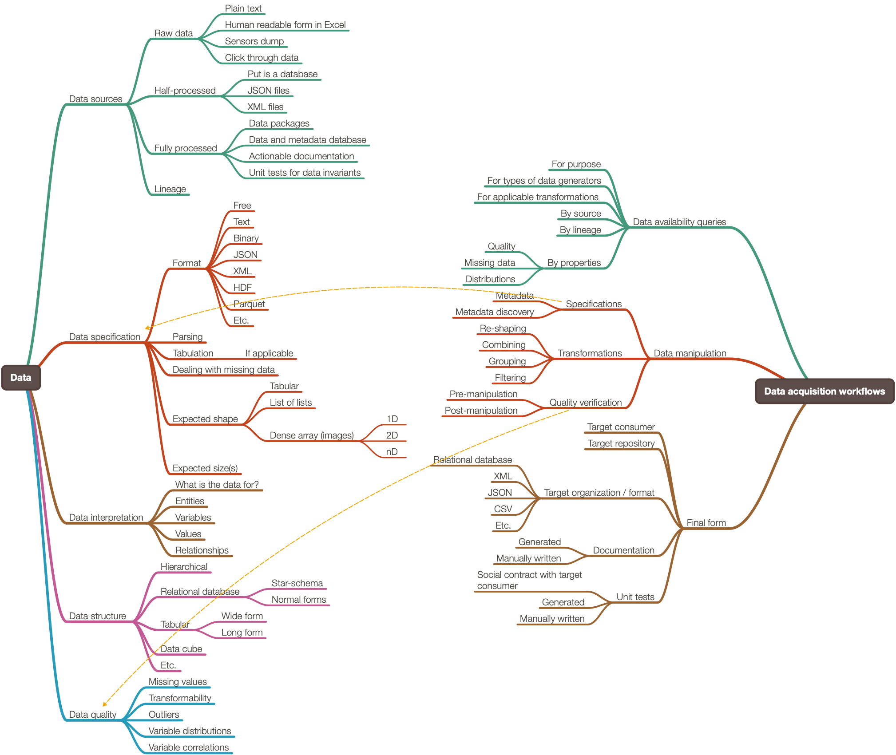

# Raku DSL::English::DataAcquisitionWorkflows
    
[](https://www.gnu.org/licenses/gpl-3.0)

## In brief

This Raku Perl 6 package has grammar classes and action classes for the parsing and
interpretation of natural language commands that specify Data Acquisition (DA) workflows.

It is envisioned that the interpreters (actions) are going to target different
programming languages: R, Mathematica, Python, etc.

This mind-maps shows the conversational agent components this grammar addresses:



This 
[org-mode file](./org/DataAcquisitionWorkflows.org) 
is used to track project's progress.

------

## Installation

```shell
zef install https://github.com/antononcube/Raku-DSL-Shared.git
zef install https://github.com/antononcube/Raku-DSL-Entity-English-Metadata.git
zef install https://github.com/antononcube/Raku-DSL-English-DataAcquisitionWorkflows.git
```

------

# Examples

General recommendation request:

```perl6
use DSL::English::DataAcquisitionWorkflows;

say ToDataAcquisitionWorkflowCode(
    "what data can I get for time series investigations?;
     why did you recommend those",
    "WL-Ecosystem");
``` 

Recommendation request with subsequent filtering:

```perl6
say ToDataAcquisitionWorkflowCode(
    "I want to investigate data that cross references good purchases with customer demographics
     keep only datasets that can be transformed to star schema",
    "WL-Ecosystem");
``` 

Data quality verification specification:

```perl6
say ToDataAcquisitionWorkflowCode(
    "verify the quality of the database dbGJ99;
     what fraction of records have missing data;
     what are the distributions of the numerical columns",
    "WL-Ecosystem");
``` 

Here is a more complicated, statistics pipeline specification:

```perl6
say ToDataAcquisitionWorkflowCode(
    "how many people used customer service data last month;
     what is the breakdown of data sources over data types;
     where textual data is utilized the most;
     plot the results;", 
    "R-tidyverse")
```

Here is a recommendation specification (by collaborative filtering):

```perl6
say ToDataAcquisitionWorkflowCode(
    "what data people like me acquired last month;
     which of those I can use for classfier investigations;
     show me the data sizes and metadata;", 
    "WL-Ecosystem")
```

------

## Implementation notes

The general structure of this package and its grammar (and sub-grammars) design is analogous 
the structure and grammars of the Raku package
[DSL::English::FoodPreparationWorkflows](https://github.com/antononcube/Raku-DSL-English-FoodPreparationWorkflows),
[AAr3].

The original versions of the grammars were generated using Mathematica.
See the notebook 
["Data-Acquisition-Workflows-grammar-generation.nb"]()

------

## References

### Repositories

[AAr1] Anton Antonov,
[DSL::Shared Raku package](https://github.com/antononcube/Raku-DSL-Shared),
(2020),
[GitHub/antononcube](https://github.com/antononcube).

[AAr2] Anton Antonov,
[DSL::Entity::Metadata Raku package](https://github.com/antononcube/Raku-DSL-Entity-Metadata),
(2021),
[GitHub/antononcube](https://github.com/antononcube).

[AAr3] Anton Antonov,
[DSL::English::FoodPreparationWorkflows Raku package](https://github.com/antononcube/Raku-DSL-English-FoodPreparationWorkflows),
(2021),
[GitHub/antononcube](https://github.com/antononcube).

### Videos

[AAv1] Anton Antonov,
["Multi-language Data Acquisition Conversational Agent (extended version)"](https://www.youtube.com/watch?v=KlEl2b8oxb8),
(2021),
[YouTube.com](https://www.youtube.com/channel/UC5qMPIsJeztfARXWdIw3Xzw).